# auto-ztp
This repo is aimed is to store templates of modules and workspaces to be consumed by automatically by the iac and provisioning repository 

## Process to create vpc peering

 Follow the next [link](https://www.howtoforge.com/how-to-create-a-vpc-peering-between-2-vpcs-on-aws/)

### Results of VPC Peering

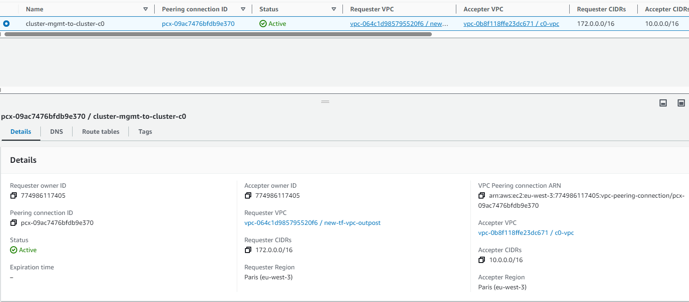

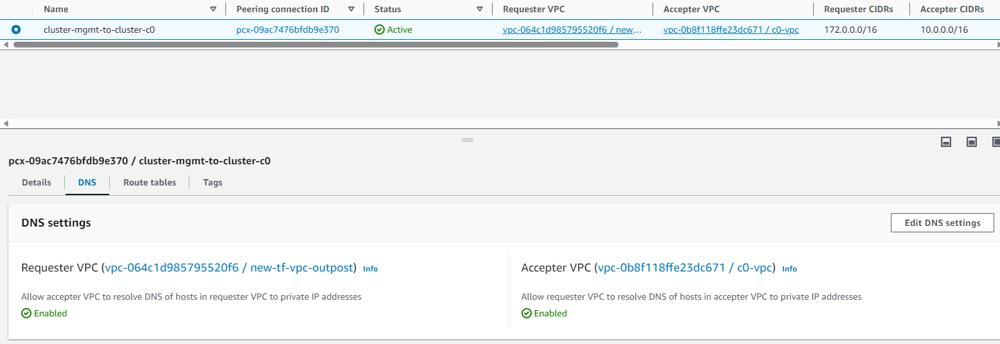

You will see the Route tables once you configured these in the security groups

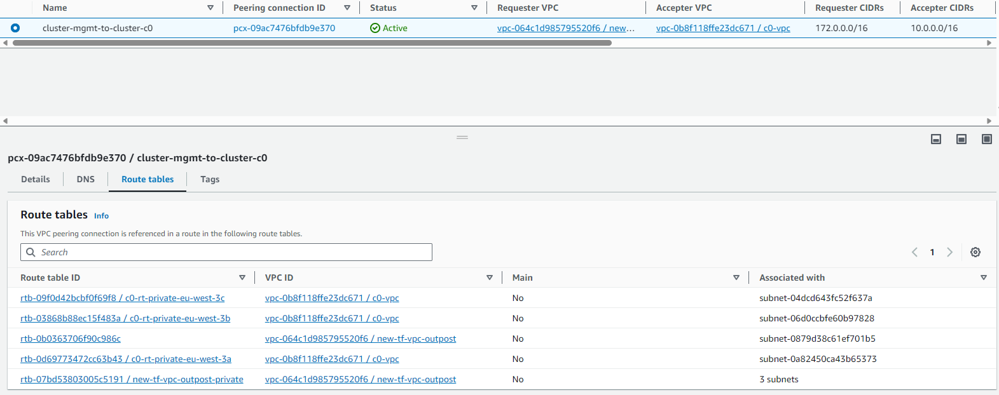

 ### Results of Route Tables

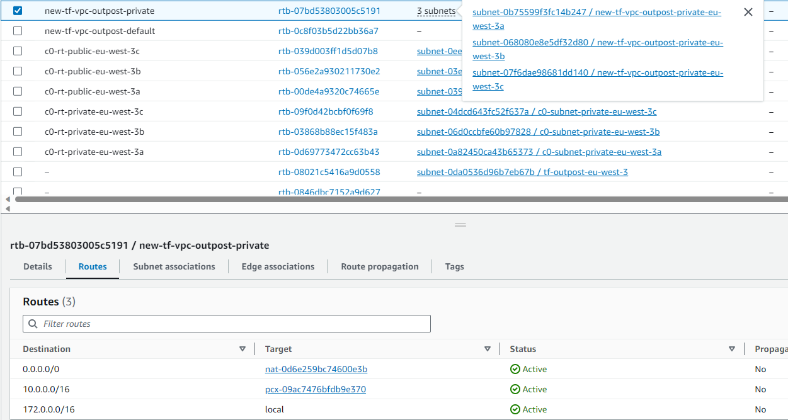

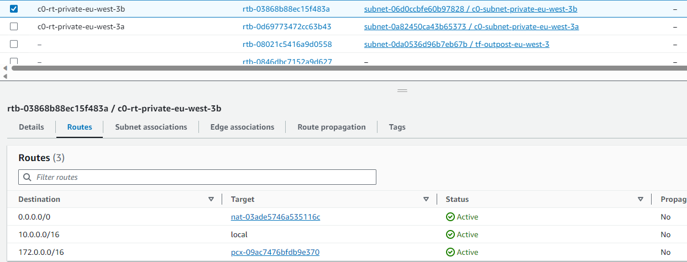

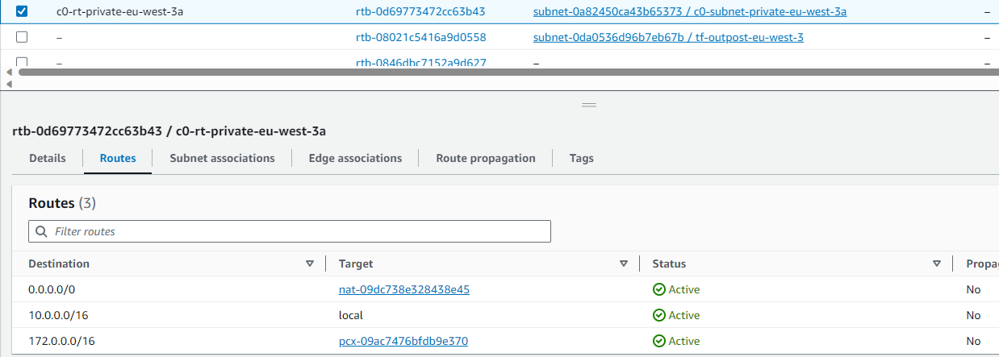

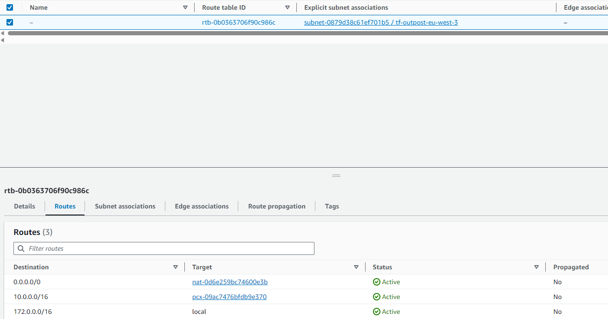

 ### Results Security Groups

The sg-0a751dd2164c97cd1/c0-lb is of the load balancer to cluster api

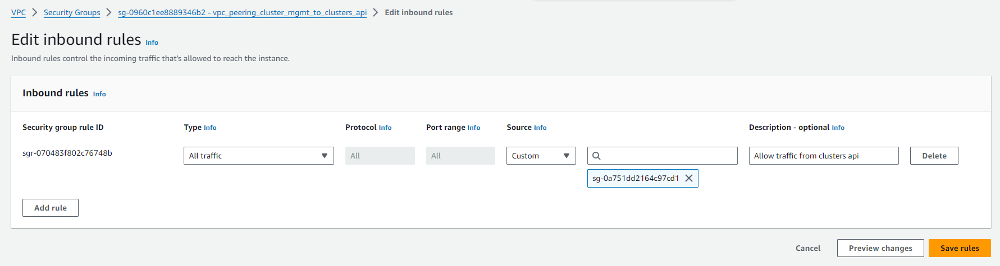

The sg-064b13cdf2503140e / rke2_cluster_sgs is part of the sgs cluster-mgmt

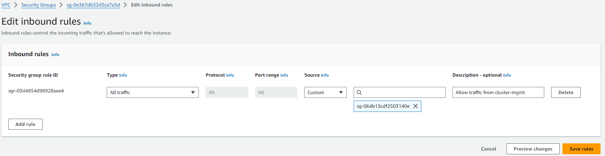

## Attach the sgs to instances and lb

1. Attach the vpc_peering_clusters_api_to_cluster_mgmt to lb

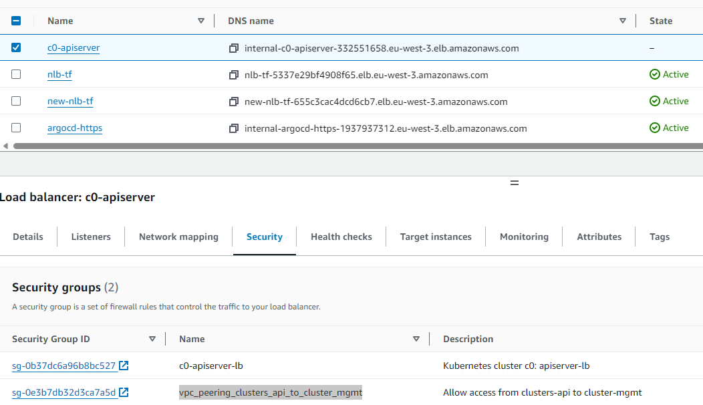

1. Attach the vpc_peering_cluster_mgmt_to_clusters_api to cluster-mgmt's instances

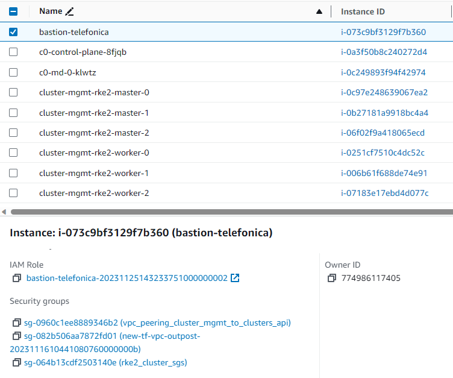

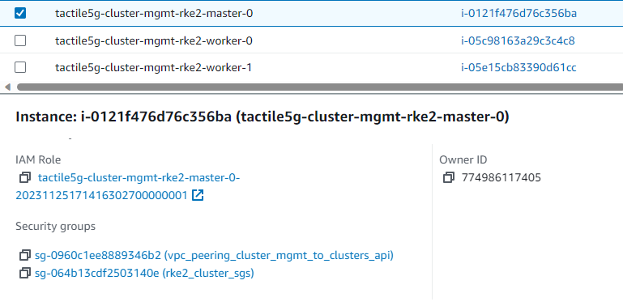

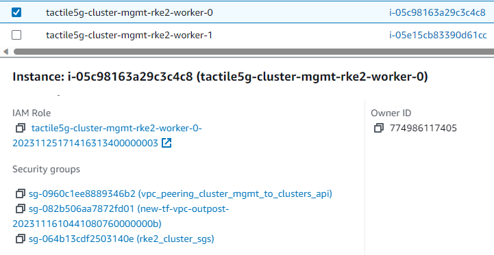

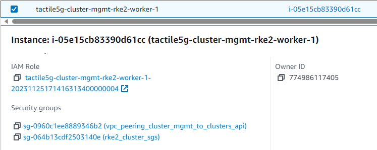

